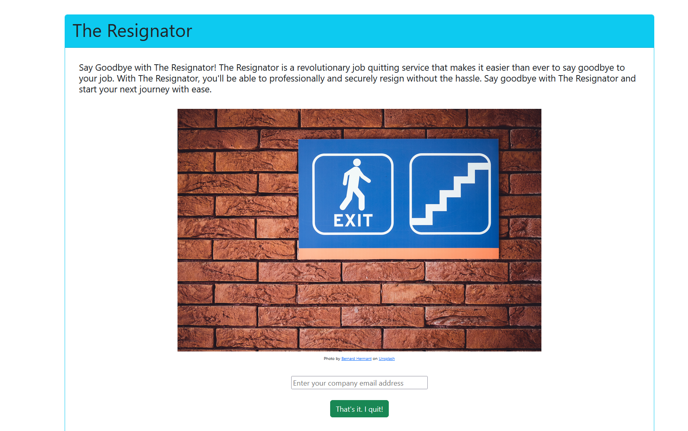

<div style="text-align: center">

<h2 align="center">The Resignator</h2>

---
## Synopsis

This project was inspired after reading [this](https://fortune-com.cdn.ampproject.org/c/s/fortune.com/2023/06/09/startup-exit-japan-quit-job-for-you/amp/) article. Essentially, I wanted to create a similar service that could take in the information of a person who wanted to quit their job, and the service would process the data and "deliver" an email on their behalf. If this project was launched into the real world, I would probably utilize Amazon Pay and Amazon Simple Email Service, but as it is, this is just a quick home brew project that is only hosted locally and no email is actually delivered.


---
## Lessons Learned


<div style="text-align: left">
1. Browsers don't like pulling CSV files without a server enabled.<br>
2. How to parse a CSV file in Javascript.<br>
3. There's more than one script type that can be accepted into the head section of an HTML file.<br>
4. HTML's "font" tag has been deprecated in favor of CSS. Back in my day, we had to use font tags in the snow. Both ways.<br>
5. An "await" before using sessionStorage.setItem() will save a lot of headache.<br>
6. CORS errors. Nuff said.
</div>

---
## Build Tools
</div><div style="text-align: left">
* Java <br>
* Javascript <br>
* HTML <br>
* CSS <br>
* Windows Powershell <br>
* Git <br>
* Github <br>
* Axios <br>
* Node.js <br>
* npm <br>
* http-server <br>
* AWS SAM <br>
* CSV <br>
* JSON <br>
* Jackson library <br>
* Log4J <br>
* Gradle (using Groovy) <br>
* Amazon SDK <br>
* AWS Lambda <br>
* Docker <br>
* Postman <br>
</div>

---
## View This Project


[](https://youtu.be/TVAu_UHDRqA)


<p>View this project: <a href="https://youtu.be/TVAu_UHDRqA"><b>here<b></a>.</p>

---
## How to Launch
1. Launch front end from the web directory with ```http-server``` <br>
2. Start Docker <br>
3. From the root directory, build via ```sam build --use-container``` <br>
4. From the root directory: ```sam local start-api``` to start the backend in a separate terminal<br>
5. Open index.html in your web browser via ```localhost:8080/static_assets/```
6. View output in the backend terminal. :)

---
## Contact

Alex Murillo - alex.d.murillo@protonmail.com
<br>
<a href="https://www.linkedin.com/in/alexdmurillo/"></a>


